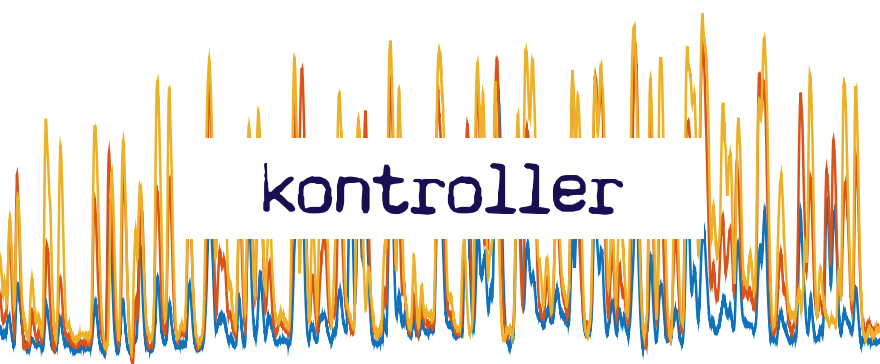
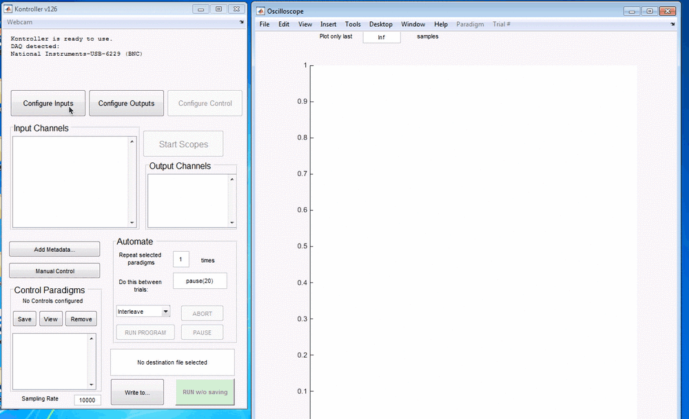
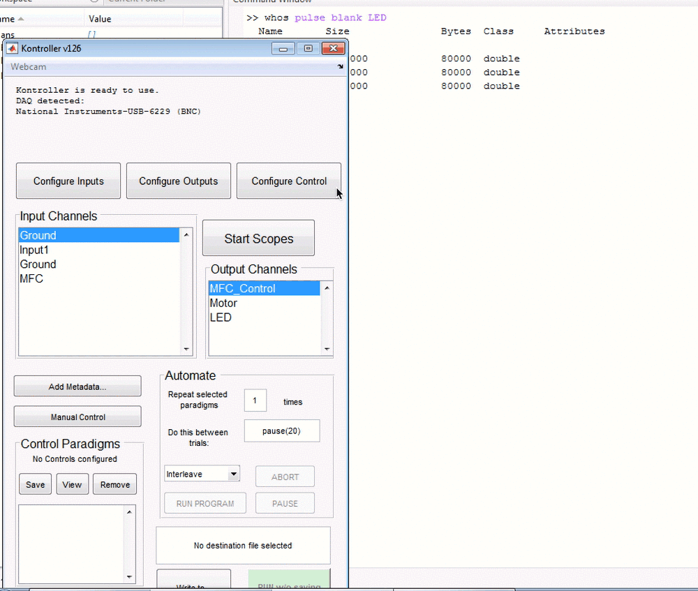
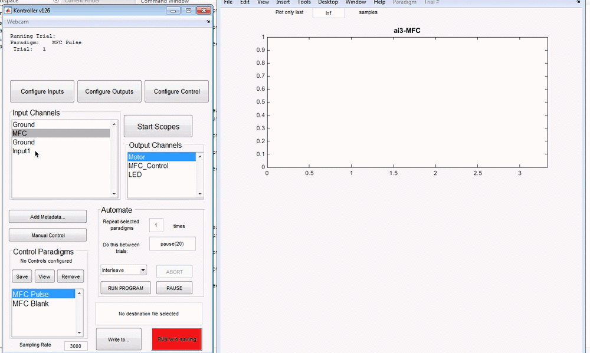

# kontroller



[](http://opensource.org/licenses/GPL-2.0) [](http://dx.doi.org/10.5281/zenodo.14584)

**a free wrapper for MATLAB DAQ to make experiments easier**

Kontroller is a free wrapper for MATLAB's DAQ toolbox that makes it easy to begin doing experiments. Spend less time writing code and more time doing real science. I don't know of a simpler solution that lets you get started with your experiments. If you know of one, please [write to me](http://srinivas.gs/#contact).

# Features

### Click-and-Type Setup

Name a physical channel on your NI board to record from it or write to it. Delete the name to stop using it. It's that simple.




### Configure control paradigms

Choose vectors from your workspace to construct control paradigms to write data to devices. 




### Analogue/digital inputs, and analogue outputs. Simultaneously.

Record continuous analogue data while writing predefined vectors to analogue or digital outputs at the same time. Control LEDs while measuring from light sensors. Turn stepper motors while measuring from a strain gauge. No matter what your task, it's the same config.



### Oscilloscope

Don't want to record data but just see what your data stream looks like? A handy scope function looks at live data without recording anything. You can throw away that clunky Tektronik that's been hogging space on your ephys rack. 


### Automation 

`kontroller` can be easily automated by creating `Control Paradigms` that specify sequences of reads and writes to your devices. `Control Paradimgs` can be run one after the other, with arbitrary inter-trial functions. 

### Programmable 

`kontroller` is fully programmable, and can be used as a command line tool for more complex tasks. 

# Installation

The recommended way to install `kontroller` is to use my package manager:

```matlab
% copy and paste this into your MATLAB prompt
urlwrite('http://srinivas.gs/install.m','install.m'); 
install sg-s/kontroller
install sg-s/srinivas.gs_mtools
```
if you have [git](http://www.git-scm.com/) installed, you can 

```bash
# copy and paste this into into your shell
git clone https://github.com/sg-s/kontroller
git clone https://github.com/sg-s/srinivas.gs_mtools 
```
and don't forget to add these folders to your `MATLAB path`

# Roadmap and future

`kontroller` will not be developed further, apart from bug fixes. [kontroller2](https://github.com/sg-s/kontroller2) is an exciting new object-oriented successor to `kontroller`, which will extend `kontroller`'s capabilities in many ways. 

# Data Format

`kontroller` generates MATLAB .mat data. In each .mat file generated by `kontroller`, the following variables exist:

```matlab
ControlParadigm 
% 1xN structure containing control signals that were used
% ControlParadigm contains fields called "Name" and "Outputs". 
% "Outputs" is a CxT matrix, where C is the # of output channels, 
% and T is the total length of the trial

data 	
% 1xM (M<=N) structure containing data
% fields in data are dynamically created by the names of the input channels
% e.g., data(4).voltage is a NxT matrix, for N trials from the 4th control
% paradigm

metadata 
% 1x1 structure containing metadata, if any

OutputChannelNames 
% 1xC cell array containing names of output channels

SamplingRate 
% scalar, samples/sec

timestamps 
% 3xT matrix containing the timestamps of every trial acquired
% timestamps(1,:) contains the control paradigm corresponding to every trial
% timestamps(2,:) contains the trial # of every trial
% datestr(timestamps(3,:)) shows the timestamps every trial was started
```


# Citing

If you use `kontroller`, please [write to me](http://srinivas.gs/#contact) to cite this appropriately! 

The following publications have used `kontroller`:

1. [Presynaptic GABA Receptors Mediate Temporal Contrast Enhancement in Drosophila Olfactory Sensory Neurons and Modulate Odor-Driven Behavioral Kinetics](http://eneuro.org/content/3/4/ENEURO.0080-16.2016.abstract)

# License

[GPL v3](http://gplv3.fsf.org/)

